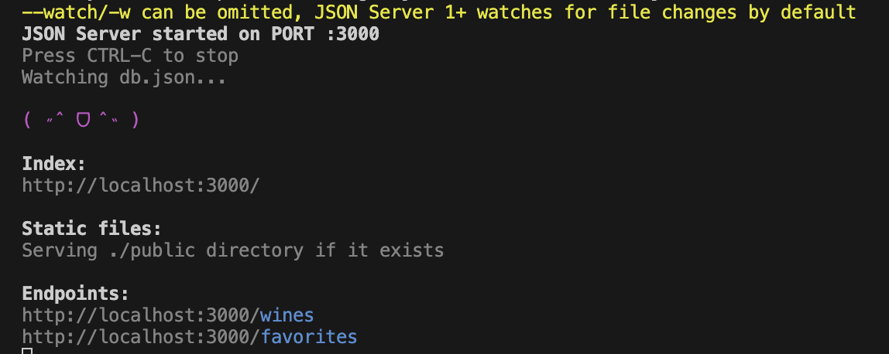
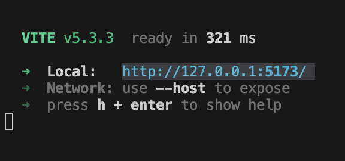
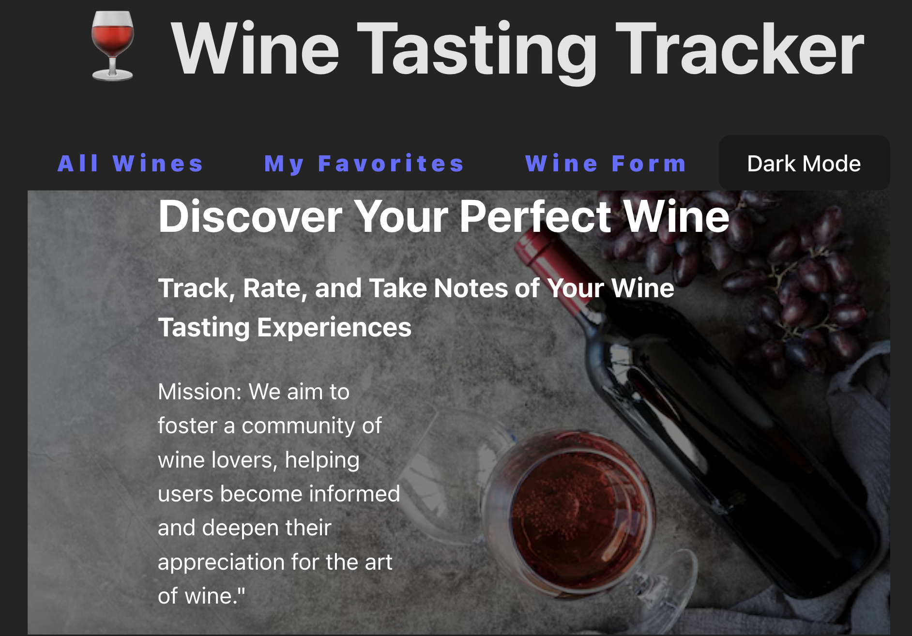

# Wine Tasting Tracker

Track, rate, and take notes of your wine tasting experiences. 

The purpose of this single-page application is to foster a community of wine lovers, helping users become informed and deepen their appreciation for the art of wine.

## Home

- [Dependencies](#dependencies)
- [Starting the Application](#starting-the-application)
- [Using the Application](#using-the-application)
- [Optional Features](#future-roadmap)
- [License](#license)

## Intro to Project

- This project was made to complete the assignment `Phase 2 Project` for the `SE-West-060324` class for the [Flatiron](https://flatironschool.com/) Software Engineering Boot Camp.
- The project was completed using the following: `React`, `React Router`, `react-router-dom`, `json-server`, `UUID`, `yup`, and `react-hot-toast`.

## Dependencies

- The following is needed to run this application: `React`, `React Router`, `react-router-dom`, `json-server`, `UUID`, `yup`, and `react-hot-toast`.

- You must have access to these dependencies in the directory that you are running this application in. If your environment does not have these requirements, you may install them in this order by going to these websites and following the installation instructions:

- [Npm - Node.JS](https://www.npmjs.com/package/node)

- [Npm - JSON Server](https://www.npmjs.com/package/json-server)

- [Npm - react-router-dom](https://www.npmjs.com/package/react-router-dom)

- [Npm - UUID](https://www.npmjs.com/package/uuid)

- [Npm - yup](https://www.npmjs.com/package/yup)

- [Npm - react-hot-toast](https://www.npmjs.com/package/react-hot-toast)

## Starting the Application

- Fork and clone this repo, and open in your favorite code editor.
- Run `npm install` or `npm i` to install necessary packages.
- Make sure nothing is currently running on `http://localhost:3000`.
- Open a terminal window in the main directory of where this project is located on your computer.
- Run `json-server --watch db.json`
- It should be running on `http://localhost:3000` and your terminal should look something like this:
=========================================================================================================================
    
=========================================================================================================================
- Open a terminal window in the main directory of where this project is located on your computer.
- Run `npm run server`.
- It should be running on `http://127.0.0.1:5173/` and your terminal should look something like this:
=========================================================================================================================
  
=========================================================================================================================
- Using the shortcut command+click (mac user) or ctrl+click (windows user) on the server link to open in your desire brower to open the application.
- It should take you to a page that looks like this:
=========================================================================================================================
  

## Using the Application

User can: 
- see the landing page and the navigate to the different links in the header section
- click on each image to see more details
- click on the `Add to My Favorites` button to save it to the `My Favorites` tab
- undo the save by clicking on the `Remove From My Favorite` tab
- click on the `Wine Form` link in the header section to fill out a form to add a new wine to the collection
- peform the save/unsave of the new wine added from the form
- toggle between Dark Mode and Light Mode for ease of viewing the application
- search by the name of the wine in the `Search Wine` search bar 

## Future roadmap

This project is just the beginning phase and will continue to expand it features in:

- give suggested wines based on `My Favorites`
- partner with liquor store that allows user to purchase from if they are intersteed
- cool features to connect with other members of app
- and many more!

If you are interested in aiding the development of this application, please reach out to me via Discord @yutouyun3535.

## License

- This project is is made in conjunction with the standard `MIT` license provided by `GitHub` upon creation of a new repository. A copy of the license is included with this project in a file named: `LICENSE`.

* [Back To Top](#Wine-Tasting-Tracker)
